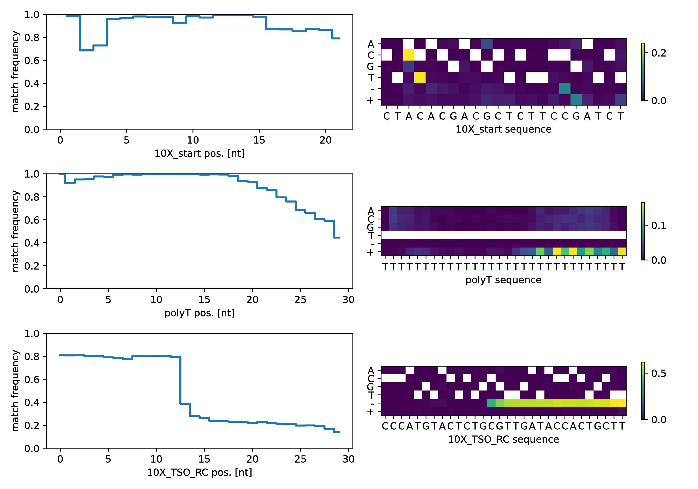
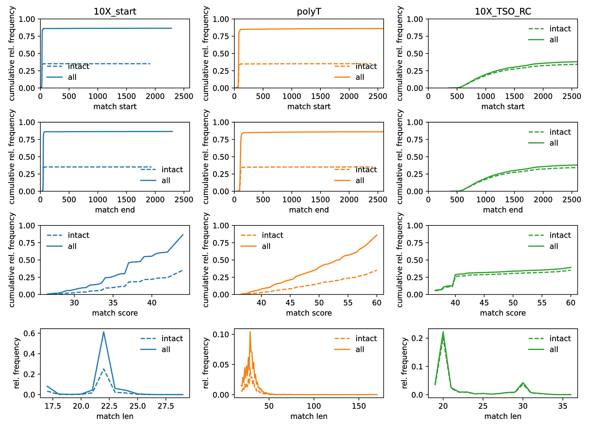

Longreads Integration
=====================

A Spacemake sample can not only be associated with Illumina sequencing reads 
via the ``--R1`` and ``--R2`` command line arguments, but can also be assigned 
long reads (e.g. PacBio, Nanopore, etc.) using the ``--longreads`` command-line 
argument.

We have added this functionality for the purpose of trouble-shooting 
problems with library construction (see the Spacemake paper). Long sequencing reads can
capture the entire cDNA sequence, including Illumina sequencing adapters, primer handles, 
cell and UMI barcodes, polyA/T as well as the actual cDNA insert.

If you add long reads to a sample, you will enable spacemake to annotate a catalog of 
oligo sequences, thought of as building blocks of your library, against every long read. 
This allows to assess the following feaures:

  - the fraction of molecules which conform to the expected layout of building blocks.
    For example, SMART-handle, (barcode), polyT, (cDNA insert), TSO-handle. Parts in 
    parenthesis here are inferred from the spacing between the adjacent blocks but not 
    directly annotated

  - the fraction of molecules which are missing one or more the expected building blocks
  
  - size distributions of all matches and distributions of their start and end positions,
    which in turn allows to infer the size distributions of inserts and barcode sequences.

  - *concatamerizations* and unexpected, *multiple* occurrences of any building block, 
  - pointing to undesired side-reactions.

Building blocks and Signatures
------------------------------

In order to fully utilize the longread functionality, spacemake needs to know about the sequences 
of all building blocks, as well as their expected layout. 

Tying it together is a ``signature``. Signatures are defined (at the moment manually) in 
a ``longread.yaml`` file. If spacemake does not find a file with that name at the root of 
your ``projects`` folder, it will default to loading ``<spacemake-root>/spacemake/data/longread.yaml``.

Here is an excerpt from this file listing known sequence building blocks.

.. code-block:: yaml

    blocks:
        P5: AATGATACGGCGACCACCGAGATCTACACGCCTGTCCGCGG
        N70X: CTGTCTCTTATACACATCTCCGAGCCCACGAGACNNNNNNNNATCTCGTATGCCGTCTTCTGCTTG
        SMART_primer: AAGCAGTGGTATCAACGCAGAGT
        SMART_bead: AAGCAGTGGTATCAACGCAGAGTAC
        dN-SMRT: AAGCAGTGGTATCAACGCAGAGTGA
        TSO: AAGCAGTGGTATCAACGCAGAGTGAATGGG
        polyT: TTTTTTTTTTTTTTTTTTTTTTTTTTTTTT

You can see here that ``SMART_primer`` and ``SMART_bead`` are very similar sequences, 
differing only at the end, with ``SMART_bead`` containing an extra ``AC`` dinucleotide. 
In case of multiple (partial) matches to a building block, a match with higher score 
(ie more matches) will supersede an overlapping match with lower score. This allows to
distinguish the handle at the start of the capture oligos (which features the ``AC`` at the 3' end) 
from other occurrences of the SMART primer site, which might be introduced via a different route.

The next section in the YAML file describes the expected structure of sequencing reads in terms of
the building blocks. Here is an excerpt including the definition for dropseq/Nadia cDNA libraries:

.. code-block:: yaml

    signatures:
        chromium:
            label: chromium
            prio: 1
            color: gray
            CB: r1[0:16]
            UMI: r1[16:26]
            intact: 10X_start,polyT,10X_TSO_RC
            other: 10X_C3_RT_PRIMER,10X_C2_RT_PRIMER
            cDNA_after: polyT
            prefixes: P5
            suffixes: N70X
            read1_primer: 10X_start
            read2_primer: 10X_TSO

        dropseq:
            label: dropseq
            prio: 2
            color: gray
            CB: r1[8:20]
            UMI: r1[0:8]
            intact: SMART_bead,polyT
            cDNA_after: polyT
            other: SMART_primer,dN-SMRT,TSO,sc_primer
            prefixes: P5
            suffixes: N70X
            read1_primer: SMART_bead
            read2_primer: N70X

Other pre-defined signatures at the moment are ``visium`` (almost identical to chromium) and a couple of
experimental designs from ongoing in-house developments.

The ``prio`` and ``color`` fields are only relevant for overview plots across multiple samples 
and will affect the ordering (prio) and color for the visual representation of sample metrics.

Most important is the ``intact`` field, which lists all buidling blocks expected to be present (in that order) 
on a correct library molecule. P5 and N70X are considered optional prefixes/suffixes at this point, 
because you may choose to perform long read sequencing on a library before or 
after index PCR.

The first building block listed in ``intact`` is expected to be present in all
molecules that derive from the used capture technology (and not some contamination or artifact).
In the case of dropseq/nadia beads, this would be the SMART handle, followed by ``AC``. 
In the case of 10X Chromium or Visium libraries, it would be the ``10X_start`` primer handle attached to
the gel beads or visium slide, respectively.

Occurrences of this first building block are used to distinguish captured molecules from 'other' and 
to orient every long read (sequenced long reads can be either in forward, or reverse-complement orientation).

What happens?
-------------

As soon as at least one of your samples is associated with long sequencing reads, ``spacemake run`` 
will invoke some dedicated tools. Specifically

   1. long reads will be *aligned* against all known building blocks
   2. (overlapping) matches will be *collected* and integrated for each read
   3. based on the presence/absence of each block, each read will be *classified*
   4. *statistics* on the observed long read classes will be gathered, with particular emphasis on the 
      reads falling into the class defined as ``intact`` .
   5. *cDNA* will be extracted and mapped to the genome via `STAR-long`
   6. association of mappability and building block presence/absence is investigated
   7. report *plots* are generated for each sample in ``/processed_data/{sample_id}/longread/reports``

After these steps are completed for every sample with long reads, *overview plots* are generated, which 
present high level results across all samples, side-by-side in ``<projects folder>/longread_overview``.

If you like to utilize any of these functions outside of the spacemake/snakemake workflow you can either 
invoke the longread command via ``python -m spacemake.longread`` or by importing the ``spacemake.longread``
module from your own python scripts.

A nanopre example
-----------------

Here is a full example using a small test data-set. We will download the test data, add the 
sample to a spacemake project, run the analysis, and have a look at the output generated. We use ``wget`` 
to download a small test data set. Alternatively, you can use 
``git clone https://github.com/rajewsky-lab/spacemake-test-data.git`` to check out a collection of different
test data. Here, we further assume that a species labeled ``human`` has already been set up for spacemake [TODO: add link].

.. code-block:: console

   wget https://bimsbstatic.mdc-berlin.de/rajewsky/spacemake-test-data/longread/SRR9008425_subsample.fastq.gz

   spacemake projects add_sample --project_id=test --sample_id=test_longread --longreads=SRR9008425_subsample.fastq.gz --longread-signature=chromium --species=human
   spacemake run -np --cores=64

Spacemake lays out the following tasks to process our longread sample (shortened for brevity):

.. code-block:: console

    Job counts:
            count   jobs
            1       all
            1       cmd_align
            1       cmd_alnstats
            1       cmd_annotate
            1       cmd_edits
            1       cmd_extract
            1       cmd_overview
            1       cmd_report
            1       map_cDNA
            9
    This was a dry-run (flag -n). The order of jobs does not reflect the order of execution.

    rule cmd_align:
        python -m spacemake.longread --parallel=64 --config=longread.yaml --cache=projects/test/processed_data/test_longread/longread/cache/ --annotation-out=projects/test/processed_data/test_longread/longread/annotation/ --stats-out=projects/test/processed_data/test_longread/longread/stats/ --report-out=projects/test/processed_data/test_longread/longread/reports/ --examples-out=projects/test/processed_data/test_longread/longread/examples/ --sample=test_longread --signature=chromium align SRR9008425_subsample.fastq.gz 

    rule cmd_extract:
        python -m spacemake.longread --parallel=1 --config=longread.yaml --cache=projects/test/processed_data/test_longread/longread/cache/ --annotation-out=projects/test/processed_data/test_longread/longread/annotation/ --stats-out=projects/test/processed_data/test_longread/longread/stats/ --report-out=projects/test/processed_data/test_longread/longread/reports/ --examples-out=projects/test/processed_data/test_longread/longread/examples/ --sample=test_longread --signature=chromium extract SRR9008425_subsample.fastq.gz 2> projects/test/processed_data/test_longread/longread/cDNA/test_longread.log > projects/test/processed_data/test_longread/longread/cDNA/test_longread.fa

    rule cmd_annotate:
        python -m spacemake.longread --parallel=1 --config=longread.yaml --cache=projects/test/processed_data/test_longread/longread/cache/ --annotation-out=projects/test/processed_data/test_longread/longread/annotation/     --stats-out=projects/test/processed_data/test_longread/longread/stats/ --report-out=projects/test/processed_data/test_longread/longread/reports/     --examples-out=projects/test/processed_data/test_longread/longread/examples/ --sample=test_longread --signature=chromium annotate SRR9008425_subsample.fastq.gz
    
    rule map_cDNA:
        mkdir -p projects/test/processed_data/test_longread/longread/cDNA/tmp/
        STARlong --runThreadN 8 --genomeDir species_data/human/star_index --genomeLoad NoSharedMemory --readFilesIn projects/test/processed_data/test_longread/longread/cDNA/test_longread.fa --readFilesType Fastx --outSAMtype BAM Unsorted --outSAMunmapped Within --outSAMattributes All --outSAMprimaryFlag AllBestScore --outStd BAM_Unsorted --outFilterMultimapScoreRange 2 --outFilterScoreMin 0 --outFilterScoreMinOverLread 0 --outFilterMatchNminOverLread 0 --outFilterMatchNmin 30 --outFilterMismatchNmax 1000 --winAnchorMultimapNmax 200 --seedSearchStartLmax 12 --seedPerReadNmax 100000 --seedPerWindowNmax 100 --alignTranscriptsPerReadNmax 100000 --alignTranscriptsPerWindowNmax 10000 --outFileNamePrefix projects/test/processed_data/test_longread/longread/cDNA/tmp | /data/rajewsky/shared_bins/Drop-seq_tools-2.4.0/TagReadWithGeneFunction I=/dev/stdin O=projects/test/processed_data/test_longread/longread/cDNA/test_longread.bam ANNOTATIONS_FILE=species_data/human/annotation.gtf

    rule cmd_report:
        python -m spacemake.longread --parallel=1 --config=longread.yaml --cache=projects/test/processed_data/test_longread/longread/cache/     --annotation-out=projects/test/processed_data/test_longread/longread/annotation/     --stats-out=projects/test/processed_data/test_longread/longread/stats/     --report-out=projects/test/processed_data/test_longread/longread/reports/     --examples-out=projects/test/processed_data/test_longread/longread/examples/ --sample=test_longread --signature=chromium report

    rule cmd_edits:
        python -m spacemake.longread --parallel=1 --config=longread.yaml --cache=projects/test/processed_data/test_longread/longread/cache/     --annotation-out=projects/test/processed_data/test_longread/longread/annotation/     --stats-out=projects/test/processed_data/test_longread/longread/stats/     --report-out=projects/test/processed_data/test_longread/longread/reports/     --examples-out=projects/test/processed_data/test_longread/longread/examples/     --sample=test_longread     --signature=chromium       edits SRR9008425_subsample.fastq.gz

    rule cmd_overview:
        python -m spacemake.longread --parallel=1 --config=longread.yaml overview --output longread_overview/ projects/test/processed_data/test_longread/longread/stats/test_longread.report.tsv

Ok, sounds good. Let's do this.

.. code-block:: console

    spacemake run -p --cores=64

.. note:: 

    please adapt ``--cores=64`` to a number appropriate for your machine. The `align` stage of the longread processing is slow
    and benefits strongly from parallelization, we therefore recommend running on a machine with many cores.

Graphical reports
-----------------

After `spacemake run` has finished, you can check the `longread/reports` directory under each sample that was assigned some longread data. You will find several graphical reports
here. Let's walk through the example nanopore data:

Library overview plot
^^^^^^^^^^^^^^^^^^^^^

.. image:: img/test_longread.donuts.png
    :width: 100%

The three panels in the `test_longread.donuts.pdf` plot provide an overview of the library. The donut on the top-left
shows that the majority of reads contain at least ``10X_start`` oligo matches, which means they derive from the capture technology and are labeled `bead-related`.
This, of course is a good thing. The remaining slices of the pie-chart correspond to reads where the 10X_start sequence was either absent or mutated enough to match more with other, related building-blocks. 
A certain fraction of such reads is to be expected and normal. 

The donut plot on the right is a zoom into the `bead-related` section of the left donut plot. Here, we can see that slightly less than half of all reads conform to the expected, full signature. About 50% lack a recognizable match to the template-switch oligo, which could either indicate incomplete long reads or a nanopore library construction strategy which truncates the TSO.

Another useful way to look at the data is the horizontal bar-plot on the lower left. Please note that the x-axis here is logarithmic. Consistent with what we just saw, the most abundant species of long reads is classified as `10X_start,polyT`, i.e. lacking the TSO match. However, this is closely followed by `10X_start,polyT,10X_TSO_RC`, which is the expected species. Note that the `_RC` at the end indicates the reverse complement, which is indeed expected here.
Together these two read species account for the vast majority of the library.

Zooming in on the dependence between the expected building blocks is the last plot, on the lower left. The first bar corresponds to the green `bead-related` slice in the first donut plot. If there were no artifacts or contaminations, one could read this as the fraction of capture oligos on the gel beads which were correctly synthesized such as to begin with `10X_start`.
The next bar-plot shows the fraction of all reads, *starting with `10X_start`* which then go on to display a polyT match next, i.e. they capture the dependence between `10X_start` and `polyT`. As you can see, this is strongly coupled with much more than 95%. In contrast, the last bar is again a condensation of our earlier finding that many reads lack a good TSO match. It represents the fraction of all reads which begin with `10X_start,polyT`, which then continue to contain `10X_TSO_RC`.

Oligo alignment quality plot
^^^^^^^^^^^^^^^^^^^^^^^^^^^^

In order to troubleshoot issues with the building block sequences, up to 1,000 instances of detected building block matches are sampled from the reads and their alignments against the reference sequence is condensed as a step-plot (left side) with reference sequence position on the x-axis and per-base match rate on the y-axis.
To provide more detail, the right side details the kinds of mismatches , deletion and insertions which are observed (y-axis) at each position (x-axis) as a heatmap. Each row in this plot corresponds to one of the expected building blocks listed in ``intact``.

Here, we finally can find a clue as to why TSO-matches are underrepresented: The second half of the TSO sequence is very rarely part of the sequencing reads, perhaps indicating that the nanopore sequencing library was generated with a nested primer, masking part of the TSO, or we are not aligning with the correct reference sequence. However, the heatmap indicates neither mismatches nor insertions, only deletions from position 12 of the TSO_RC sequence on, more consistent with the idea that the reads "just end" before the entire TSO sequence is read.

Histograms
^^^^^^^^^^

Lastly, the longread module generates cumulative histograms for the start positions (first row), end-positions (second row), match scores (third row) and match lengts (fourth row) of the expected building blocks (columns). Importantly, this plot distinguishes between occurrences that are part of `intact` signature reads and `all` occurrences of a given building block. This allows to quickly spot if we are looking at perhaps different species of molecules/artifacts which are associated with unexpected positioning or spacing of the blocks. This is not the case here, again consistent with the idea that the TSO matches are simply truncated and reads otherwise conforming to expectations.