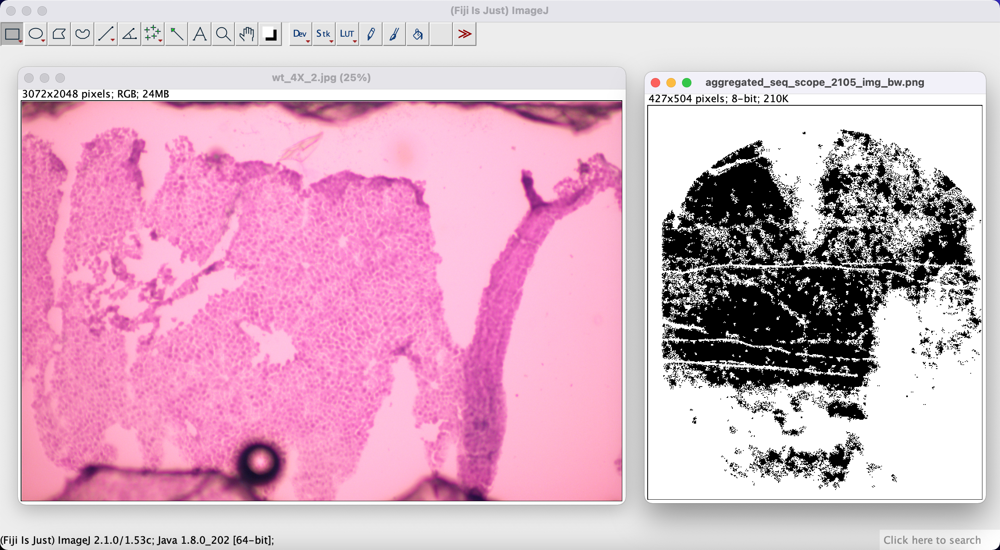
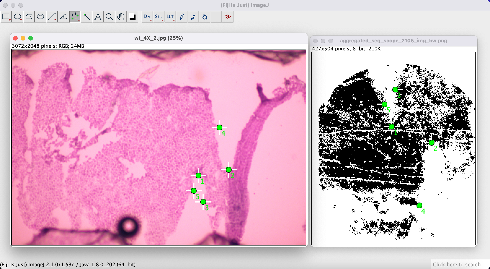
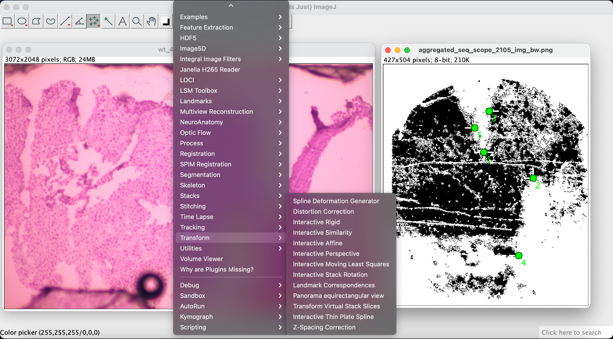
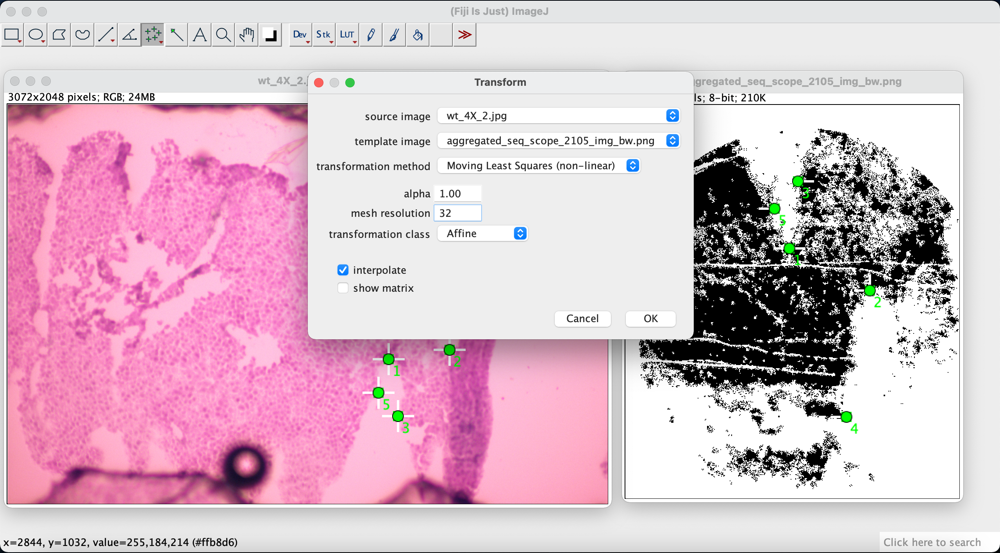
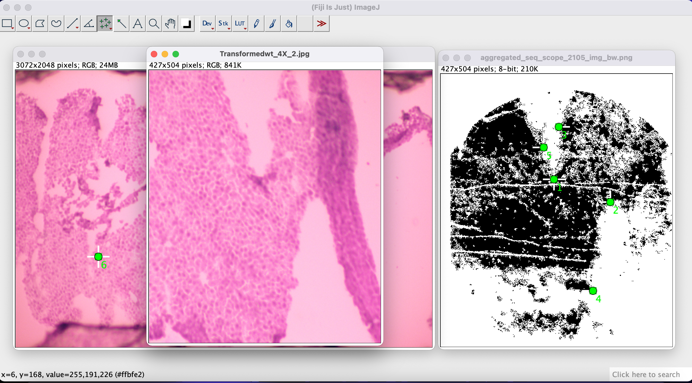
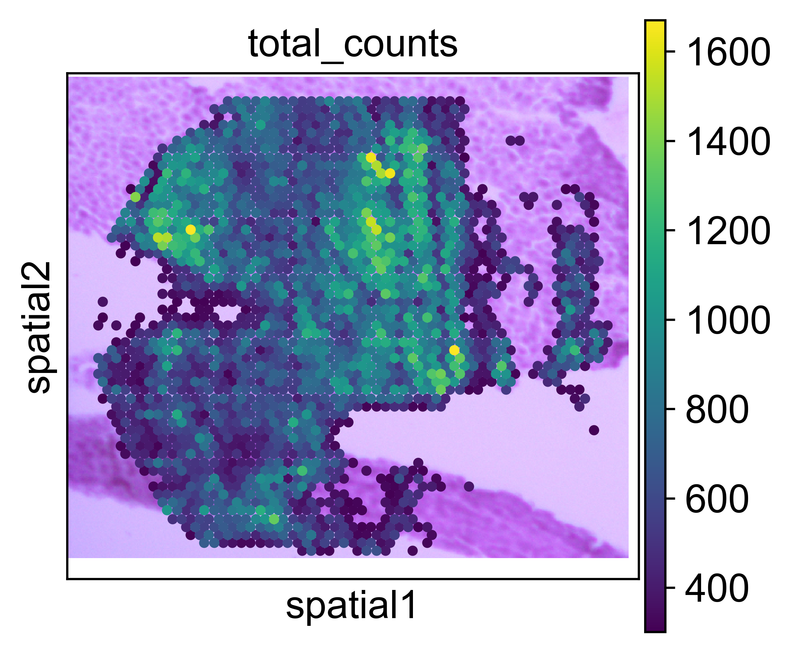

Manual H&E alignment
====================

Before you begin
----------------

Before start, make sure that you have installed spacemake as specified :ref:`here <installation>`

For the manual allignment we will use Fiji, an open-source image processing tool. Download it from `here <https://imagej.net/software/fiji/downloads>`_.

We will be using tile nr 2105 from `Seq-scope <https://www.sciencedirect.com/science/article/abs/pii/S0092867421006279>`_ for this tutorial. The corresponding H&E image is
`wt_4X_2.jpg <https://deepblue.lib.umich.edu/data/downloads/qv33rw833>`_.

Step 1 - generate an expression image
-------------------------------------

First using the command line we generate an aggregated expression image. In the directory of your spacemake project, type:

.. code-block:: console

    spacemake spatial create_aggregated_expression_img \
        --project_id seq_scope \
        --sample_id seq_scope_liver_2105 \
        --run_mode seq_scope \
        --processed_data False \
        --binary True \
        --out_img aggregated_seq_scope_2105_img_bw.png

This will generate a black and white image based on expression data.

Step 2 - load images into Fiji
------------------------------

In the next step we load both images into Fiji like below:

Step 3 - select corresponding points
------------------------------------

Next, using the *Multi-point Tool* we manually select corresponding points between our expression image and the H&E image. 
Select a point on one of the images, and then select a corresponding point on the other image. Do this for at least 4-5 corresponding points for a better match.

Step 4 - align the images
-------------------------

We then use the `Landmark Correspondences <https://imagej.net/plugins/landmark-correspondences>`_ plugin to align the two images based on the correspondencing points we
selected in the previous step. We go to *Plugins -> Transform -> Landmark Correspondences*:

In the pop-up window we select H&E image as the *source image* and expression image as the *template image*.
For the *transformation method* select *Moving Least Squares (non-linear)*. Set the *alpha* to *1.00* and the *mesh resolution* to *32*.
Set the *transformation class* to *Affine*.

After the transformation we have the two images aligned. We can now save our transformed H&E image (which is aligned with our spatial data).

Step 5 - attach the aligned image
---------------------------------

First we load the spacemake processed Seq-scope tile nr 2105 data:

.. code-block:: ipython3

    from spacemake import Spacemake

    spmk = Spacemake('/path/to/your/spacemake/project')

    adata_2105 = spmk.load_processed_adata(
        project_id = 'seq_scope',
        sample_id = 'seq_scope_liver_2105',
        run_mode_name = 'seq_scope',
        umi_cutoff = 300
    )

Then we load the previously manually aligned image and attach it to our data:

.. code-block:: ipython3

    from spacemake.spatial.he_integration import attach_he_adata
    import cv2

    matched_he = cv2.imread('./Transformedwt_4X_2.tif')

    adata = attach_he_adata(adata_2105.copy(),
                            matched_he,
                            push_by_spot_diameter=False,
                            raw_aligned=True)

After attachment, we can plot our expression data on top of the aligned H&E with `scanpy <https://github.com/theislab/scanpy>`_:

.. code-block:: ipython3

    import scanpy as sc

    sc.set_figure_params(dpi=300)

    sc.pl.spatial(adata, color='total_counts')

.. note::
    
    As axes in scanpy are flipped with respect to the axes in Fiji, because Fiji reads the image axes in different order.
